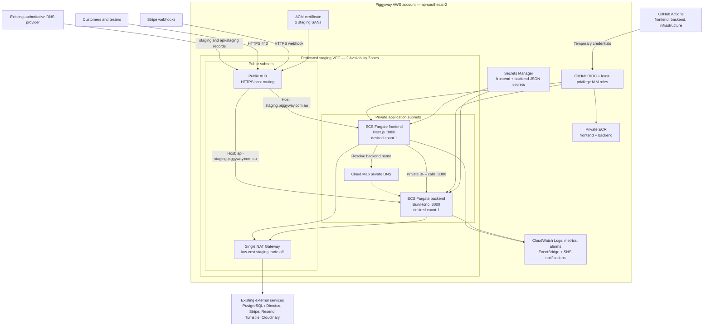

# AWS staging architecture and delivery plan

**Linear issue:** PIG-10  
**Status:** Proposed for approval  
**Region:** Australia (Sydney), `ap-southeast-2`  
**Cost profile:** Low-cost staging  
**Last reviewed:** 2026-08-05

## 1. Purpose

This document defines the target design submitted for approval for a dedicated
AWS staging environment for the Piggyway frontend and backend. Once approved,
it is the implementation contract for PIG-11 and the later application
delivery work.

This design does not authorize resource creation or application deployment.
The approval gates in section 16 must be closed first.

## 2. Decisions

| Area                  | Decision                                                                                                         | Reason                                                                                                                                                                    |
| --------------------- | ---------------------------------------------------------------------------------------------------------------- | ------------------------------------------------------------------------------------------------------------------------------------------------------------------------- |
| AWS Region            | `ap-southeast-2` (Sydney)                                                                                        | Closest AWS Region to the Australian business and users.                                                                                                                  |
| AWS account           | Use the existing Piggyway AWS account, with a dedicated staging VPC, roles, secrets, repositories, and cost tags | Avoids the administration overhead of a second account while preserving resource-level isolation. Revisit separate accounts before production.                            |
| Frontend domain       | `staging.piggyway.com.au`                                                                                        | Confirmed for PIG-10.                                                                                                                                                     |
| Backend domain        | `api-staging.piggyway.com.au`                                                                                    | Confirmed for PIG-10.                                                                                                                                                     |
| Compute               | Amazon ECS on Fargate, one service for the frontend and one for the backend                                      | Both repositories already have production-style Dockerfiles and listen on port 3000.                                                                                      |
| Ingress               | One internet-facing Application Load Balancer with host-based routing                                            | Meets both domain requirements without paying for two load balancers.                                                                                                     |
| Service networking    | Fargate tasks in private subnets with no public IPs                                                              | Prevents direct access to containers. Only the ALB and the frontend service may reach the backend.                                                                        |
| Outbound access       | One managed NAT Gateway for the staging VPC                                                                      | Backend requires Stripe, Resend, Turnstile, Cloudinary, and an externally hosted database. A single NAT is the low-cost managed option; it is intentionally not multi-AZ. |
| Service discovery     | AWS Cloud Map private namespace for frontend-to-backend traffic                                                  | Allows the Next.js BFF to call the backend privately instead of hairpinning through the public ALB.                                                                       |
| Container registry    | One private ECR repository per application                                                                       | Keeps image lifecycle and deploy permissions independent.                                                                                                                 |
| IaC                   | Terraform in a dedicated `piggy-infrastructure` repository                                                       | Keeps shared infrastructure ownership separate from application release cadence.                                                                                          |
| Terraform state       | Versioned, encrypted S3 backend with native S3 lockfile                                                          | Provides remote state recovery and locking without the deprecated DynamoDB locking pattern.                                                                               |
| Delivery identity     | GitHub Actions OIDC to narrowly scoped AWS IAM roles                                                             | Avoids long-lived AWS access keys in GitHub.                                                                                                                              |
| Minimum capacity      | One frontend task and one backend task                                                                           | Appropriate for a budget-constrained staging environment. Rolling deployments may temporarily run two tasks per service.                                                  |
| Rollback              | ECS rolling deployment circuit breaker with rollback, alarm-based rollback, and a workflow smoke-test fallback   | Returns to the last completed task definition when a release cannot become healthy.                                                                                       |
| Directus and database | Existing external hosting remains unchanged                                                                      | Directus and database hosting changes are explicitly outside PIG-10. Only connectivity is in scope.                                                                       |

## 3. Application facts that drive the design

### Frontend

- Next.js 16 standalone server on Node.js 22.
- Container listens on port `3000` and runs as a non-root user.
- Server-side `/api/*` routes act as a BFF and use `API_BASE_URL` to call the
  backend.
- Email-code login currently uses the browser-visible
  `NEXT_PUBLIC_API_BASE_URL`, so the staging backend API requires public HTTPS
  access in addition to private BFF access.
- The frontend does not currently have a lightweight health route. A
  dependency-free `GET /api/health` returning HTTP 200 must be added before the
  first deployment.

### Backend

- Bun 1.3, Hono, Drizzle ORM, PostgreSQL, and OpenAPI.
- Container listens on port `3000`, runs as a non-root user, and already
  exposes `GET /health`.
- Directly connects to PostgreSQL using a pool of up to 10 connections per
  task. Directus owns the database schema; Drizzle is a typed mirror.
- Requires outbound HTTPS for Stripe, Resend, Cloudflare Turnstile, and
  Cloudinary.
- Stripe calls the public `POST /api/v1/checkout/webhook` endpoint.
- Request rate limiting and a short-lived webhook cache are process-local.
  With the initial single backend task this is consistent; scaling above one
  task requires accepting per-task limits or moving shared state to a managed
  store in a separate change.

## 4. Architecture



## 5. Request and trust boundaries

### Public ingress

1. DNS records for both staging domains resolve to the shared ALB.
2. Port 80 only redirects to HTTPS 443.
3. The HTTPS listener uses an ACM certificate containing both exact domain
   names.
4. Listener host rules route the frontend hostname to the frontend target
   group and the API hostname to the backend target group.
5. Requests with any other host receive a fixed HTTP 404 response.
6. Stripe reaches `/api/v1/checkout/webhook` through the API hostname.

AWS Shield Standard protection is included by default. AWS WAF is not included
in the first staging iteration because of the budget; add it if the public API
experiences abuse that application rate limits cannot control.

### Private service access

- Neither ECS service receives a public IP.
- The ALB security group is the only general ingress source for both services.
- The frontend security group is additionally allowed to reach backend port
  3000 through the backend security group.
- The frontend runtime `API_BASE_URL` uses the Cloud Map backend name, for
  example `http://backend.piggyway-staging.local:3000`.
- The browser-visible `NEXT_PUBLIC_API_BASE_URL` remains
  `https://api-staging.piggyway.com.au` for the current email-login flow.
- Private subnets use one NAT Gateway for outbound internet access. This is a
  deliberate staging availability trade-off: loss of the NAT Availability
  Zone interrupts outbound calls until recovery, but avoids the cost of a
  second NAT Gateway.
- The database egress rule must be restricted to the confirmed database
  destination and port 5432 where the provider supplies stable CIDRs. If it
  does not, document the provider constraint and restrict all other egress as
  far as practical.

### Security groups

| Security group                 | Inbound                                             | Outbound                                                                 |
| ------------------------------ | --------------------------------------------------- | ------------------------------------------------------------------------ |
| `piggyway-staging-alb-sg`      | TCP 80 and 443 from the internet; 80 redirects only | TCP 3000 to frontend and backend task security groups                    |
| `piggyway-staging-frontend-sg` | TCP 3000 from ALB security group only               | TCP 3000 to backend security group; TCP 443 through NAT; DNS             |
| `piggyway-staging-backend-sg`  | TCP 3000 from ALB and frontend security groups only | TCP 443 through NAT; TCP 5432 to the confirmed database destination; DNS |

## 6. Resource inventory

Names are proposed and may receive an AWS account suffix where global
uniqueness is required.

| Service         | Resource                                       |       Count | Proposed name / configuration                                                                     |
| --------------- | ---------------------------------------------- | ----------: | ------------------------------------------------------------------------------------------------- |
| VPC             | VPC                                            |           1 | `piggyway-staging-vpc`, IPv4 CIDR selected during PIG-11 without overlapping the database network |
| VPC             | Public subnets                                 |           2 | One per Availability Zone for ALB and NAT                                                         |
| VPC             | Private application subnets                    |           2 | One per Availability Zone for Fargate tasks                                                       |
| VPC             | Internet Gateway                               |           1 | Attached to staging VPC                                                                           |
| VPC             | NAT Gateway and Elastic IP                     |      1 each | Public subnet in the primary AZ                                                                   |
| ELB             | Application Load Balancer                      |           1 | `piggyway-staging-alb`, internet-facing, two public subnets                                       |
| ELB             | Target groups                                  |           2 | `piggyway-staging-frontend-tg`, `piggyway-staging-backend-tg`, IP targets, port 3000              |
| ACM             | Public certificate                             |           1 | SANs for both confirmed staging domains, DNS validation                                           |
| ECS             | Cluster                                        |           1 | `piggyway-staging`                                                                                |
| ECS             | Services                                       |           2 | `piggyway-staging-frontend`, `piggyway-staging-backend`                                           |
| ECS             | Task definitions                               |  2 families | Immutable revisions for frontend and backend                                                      |
| Cloud Map       | Private namespace and backend service          |      1 each | `piggyway-staging.local`, service `backend`                                                       |
| ECR             | Private repositories                           |           2 | `piggyway-staging-frontend`, `piggyway-staging-backend`                                           |
| Secrets Manager | JSON secrets                                   |           2 | `piggyway/staging/frontend`, `piggyway/staging/backend`                                           |
| CloudWatch      | Log groups                                     |           2 | `/ecs/piggyway/staging/frontend`, `/ecs/piggyway/staging/backend`, 14-day retention               |
| CloudWatch      | Dashboard                                      |           1 | ALB, target health, ECS CPU/memory, task count, 4xx/5xx, response time                            |
| CloudWatch      | Alarms                                         | Initial set | Unhealthy targets, target 5xx, deployment failure, sustained CPU/memory, no running tasks         |
| EventBridge/SNS | Deployment failure rule and notification topic |      1 each | Notify the project developer and mentor; no secret values in messages                             |
| IAM             | ECS execution roles                            |           2 | Separate frontend/backend roles scoped to their ECR repo, log group, and secret                   |
| IAM             | ECS task roles                                 |           2 | No AWS API permissions initially; add explicit actions only when application code needs them      |
| IAM             | GitHub deployment roles                        |           2 | One role per application repository and staging GitHub environment                                |
| IAM             | Terraform plan/apply roles                     |           2 | Read-only plan role and approval-gated apply role                                                 |
| S3              | Terraform state bucket                         |           1 | Versioned, blocked public access, SSE-S3, native lockfile                                         |
| Budgets         | Monthly cost budget                            |           1 | Alert at 80% and 100% of the approved staging budget                                              |

### Explicitly excluded resources

- No RDS, Aurora, or other database is created.
- No Directus service, task, image, or storage is created.
- No application deployment is performed by PIG-10.
- PIG-16 and PIG-17 may later add self-hosted monitoring and centralized
  logging. CloudWatch remains the minimum AWS operational baseline.

## 7. Task sizing and availability

| Service  |       CPU |  Memory | Desired/minimum tasks | Deployment maximum | Health path                                         |
| -------- | --------: | ------: | --------------------: | -----------------: | --------------------------------------------------- |
| Frontend |  0.5 vCPU |   1 GiB |                     1 |      2 temporarily | `GET /api/health` — must be added before deployment |
| Backend  | 0.25 vCPU | 0.5 GiB |                     1 |      2 temporarily | `GET /health` — already implemented                 |

Both tasks use Linux/x86_64 initially and the Fargate-provided 20 GiB ephemeral
storage. CPU and memory alarms are used to validate these starting sizes. Move
to ARM64 only after both Docker images and dependencies pass staging tests on
ARM; it is a later cost optimization, not part of the initial rollout.

For rolling updates use desired count 1, `minimumHealthyPercent = 100`, and
`maximumPercent = 200`. ECS starts the candidate task and waits for health
before stopping the previous task, so deployments briefly incur two-task cost.
This is not full high availability: an infrastructure or AZ failure can cause
a staging outage. That is accepted for the low-cost environment.

Autoscaling is not enabled initially. A human-reviewed change may raise desired
count or task size after CloudWatch shows sustained pressure.

## 8. Health checks and smoke tests

### ALB checks

- Protocol: HTTP from ALB to the task on port 3000.
- Interval: 30 seconds.
- Timeout: 5 seconds.
- Healthy threshold: 2.
- Unhealthy threshold: 3.
- Success code: 200.
- Frontend path: `/api/health`, containing no backend or database dependency.
- Backend path: `/health`, containing no database mutation.

### Post-deployment smoke tests

After ECS reaches a stable state, the deployment workflow performs:

1. `GET https://staging.piggyway.com.au/api/health`.
2. `GET https://api-staging.piggyway.com.au/health`.
3. One read-only product/category request through the frontend BFF to verify
   frontend-to-backend and backend-to-database connectivity.
4. A response-header check for HTTPS and the expected staging host.

Authentication, payment, email, and webhook tests remain manual release checks
because they touch third-party test accounts.

## 9. Secrets and configuration

Use one JSON secret per application to reduce Secrets Manager cost while
retaining separate frontend/backend access control. ECS task definitions inject
individual JSON keys. Secret values must never be Terraform variables, image
build arguments, Terraform outputs, GitHub secrets, workflow logs, or source
files.

Terraform creates only the empty secret containers and IAM policies. After
provisioning, the project developer populates secret versions through an
audited AWS SSO session after the mentor confirms the source account and
rotation status. A secret update is followed by an explicit ECS
force-new-deployment so new tasks receive the new values.

### Frontend runtime secret keys

- `STRIPE_SECRET_KEY`
- `NEXTAUTH_SECRET`
- `GOOGLE_CLIENT_SECRET`
- `PREVIEW_SECRET`

### Backend runtime secret keys

- `DATABASE_URL`
- `JWT_SECRET`
- `STRIPE_SECRET_KEY`
- `STRIPE_WEBHOOK_SECRET`
- `RESEND_API_KEY`
- `TURNSTILE_SECRET_KEY`
- `CLOUDINARY_API_SECRET`
- `PREVIEW_SECRET`

### Non-secret runtime/build configuration

This includes ports, hostnames, `TOKEN_ISS`, `TOKEN_AUD`, `FRONTEND_URL`,
Cloudinary public identifiers, Google client ID, public Stripe/Turnstile keys,
`NEXTAUTH_URL`, `NEXT_PUBLIC_APP_URL`, `NEXT_PUBLIC_SITE_URL`, and both backend
URLs described in section 5.

`NEXT_PUBLIC_*` values are intentionally embedded in the frontend image at
build time and are not secrets. Private values must not be passed as Docker
build arguments.

Before staging deployment, rotate any populated credential-like value that has
ever appeared in a tracked example environment file, then replace it with an
empty placeholder. Rotation completion is recorded in the relevant ticket
without recording the value.

## 10. Least-privilege IAM

### ECS execution roles

Create separate execution roles for the frontend and backend. Each role may:

- pull only from its own ECR repository;
- write only to its own CloudWatch log group;
- read only its own Secrets Manager secret and the AWS-managed encryption key;
- perform the standard ECS task execution actions required by Fargate.

### ECS task roles

Application code currently uses external HTTP services and PostgreSQL rather
than AWS APIs. Start both task roles with no application permissions. Do not
reuse the execution role as the task role.

### GitHub application deployment roles

Create one role trusted only by the matching GitHub repository, the `staging`
branch, and the protected GitHub `staging` environment. Each role may:

- authenticate and push only to its own ECR repository;
- register task-definition revisions only for its service family;
- pass only its service's execution and task roles;
- update and describe only its ECS service;
- read deployment state and relevant logs/alarms needed to verify rollout.

It may not read runtime secret values, change networking/IAM, or deploy the
other application.

### Terraform roles

- `TerraformPlanRole`: read AWS configuration and state; write only the S3
  lockfile needed for a plan.
- `TerraformApplyRole`: manage only resources tagged
  `Project=piggyway, Environment=staging`, plus the explicitly named global IAM,
  ACM, ECR, and state resources.
- The apply role is available only to the protected infrastructure repository
  environment after mentor approval.
- Human access uses AWS SSO/Identity Center roles and MFA, not IAM users or
  long-lived access keys.

## 11. Infrastructure as code

### Tool and location

Use Terraform `>= 1.10` with a pinned AWS provider. Create the dedicated
repository `piggy-infrastructure` with this layout:

```text
piggy-infrastructure/
├── bootstrap/
│   └── state/                 # one-time state bucket and GitHub OIDC bootstrap
├── modules/
│   ├── network/
│   ├── load-balancer/
│   ├── ecs-service/
│   ├── ecr/
│   ├── observability/
│   └── github-oidc/
└── environments/
    └── staging/
        ├── backend.tf
        ├── main.tf
        ├── providers.tf
        ├── variables.tf
        └── outputs.tf
```

Use one staging root state initially. Splitting state before the environment is
large enough to need independent ownership adds complexity without useful
isolation.

### State storage

- S3 bucket:
  `piggyway-terraform-state-<aws-account-id>-ap-southeast-2`.
- State key: `piggyway/staging/core/terraform.tfstate`.
- Enable bucket versioning, public-access blocking, TLS-only bucket policy, and
  server-side encryption with S3-managed keys to avoid a paid customer-managed
  KMS key for this low-cost environment.
- Set `use_lockfile = true` in the S3 backend.
- Do not use DynamoDB locking; HashiCorp marks that S3 backend mechanism as
  deprecated.
- Permit state access only to the Terraform plan/apply roles. The mentor is the
  accountable break-glass approver and the developer receives only the access
  needed for normal plan/apply work. Terraform state is sensitive even when
  the configuration avoids secret values.

The bootstrap configuration is applied once by the project developer using an
approved AWS role after mentor review, then brought under the normal Terraform
review process.

### Review and apply flow

1. Pull requests run `terraform fmt -check`, `terraform validate`, security
   scanning, and `terraform plan` with the plan role.
2. The plan is attached to the PR without secrets and reviewed by the mentor.
   The developer who authored the change cannot self-approve it.
3. Merge to protected `main` does not automatically grant production access;
   it starts a staging apply job in a GitHub environment requiring mentor
   approval.
4. Apply runs only the previously reviewed commit, then stores the plan/apply
   summary as an artifact.
5. Drift detection runs weekly as a read-only plan and opens an alert; it does
   not auto-apply.
6. Console changes are emergency-only and must be reconciled into Terraform on
   the next working day.

## 12. Application delivery plan

The existing frontend and backend staging workflows are quality gates only.
Add a separate deploy job/workflow to each repository after PIG-11 provisions
the roles and resources.

### Trigger and review

- Pull requests targeting `staging` run the existing quality gate and Docker
  build validation, but do not push or deploy.
- A push/merge to protected `staging` may deploy after all required checks pass.
- Use the GitHub `staging` environment for OIDC scoping, deployment history,
  and mentor approval of infrastructure changes. Routine application releases
  may deploy automatically after their protected `staging` quality gate once
  the mentor approves that release policy.
- A manual workflow dispatch may redeploy an existing immutable image digest
  for rollback or recovery.

### Build and release steps

1. Check out the exact commit and run the repository quality gate.
2. Build the existing Dockerfile once.
3. Tag the image with the full Git commit SHA; do not deploy `latest`.
4. Scan the image and fail on an agreed critical-vulnerability policy.
5. Authenticate to AWS using GitHub OIDC.
6. Push only to the repository's ECR repository, which uses immutable tags and
   lifecycle rules retaining the most recent 20 release images.
7. Register a new task-definition revision referencing the immutable image
   digest.
8. Update only the matching ECS service and wait up to 10 minutes for stable
   state.
9. Run the smoke tests from section 8.
10. Record commit SHA, image digest, task-definition revision, initiator, and
    result in the GitHub deployment summary.

Application releases do not run `db:push`, create schemas, or deploy Directus.
Any required database or Directus change follows a separate reviewed process.

## 13. Rollback policy

Enable the ECS rolling deployment circuit breaker with automatic rollback for
both services. Also associate deployment alarms where supported.

A deployment is failed and rolled back when any of these occurs:

- the new tasks fail to reach ECS stable state within 10 minutes;
- the ECS deployment circuit breaker reaches its task-start or health-check
  failure threshold;
- the target group has zero healthy candidate targets for two consecutive
  one-minute periods;
- target HTTP 5xx responses reach at least five in a five-minute deployment
  window;
- any required post-deployment smoke test fails.

The automatic rollback target is the most recent ECS deployment in completed
state. If ECS has declared the service stable but a smoke test then fails, the
workflow registers/activates the previously recorded task-definition revision
and waits for it to stabilize. Never rebuild an old commit to roll back; deploy
the retained image digest.

After rollback:

1. Notify the deployment-failure SNS destination through EventBridge.
2. Preserve failed task logs and the image digest.
3. Do not retry automatically in a loop.
4. Require a new commit or an explicitly approved redeploy after the cause is
   understood.

Database rollback is not coupled to ECS rollback because database and Directus
changes are outside this delivery path.

## 14. Logging, monitoring, and retention

- Send container stdout/stderr to separate CloudWatch log groups through the
  `awslogs` driver.
- Use JSON or structured single-line logs where possible and propagate the
  existing `X-Request-Id` across ALB, frontend BFF, and backend.
- Retain application logs for 14 days initially. Do not log tokens, cookies,
  authorization headers, secret values, payment data, or full customer
  addresses.
- Dashboard metrics include desired/running task count, CPU, memory, ALB target
  response time, healthy host count, 4xx, 5xx, and NAT bytes.
- Alerts notify only actionable conditions: service unavailable, failed
  deployment, sustained resource exhaustion, and budget thresholds.
- PIG-16 and PIG-17 may replace or augment visualization and log aggregation,
  but must not remove the CloudWatch signals used for ECS rollback.

## 15. Initial monthly cost estimate

This is a planning estimate in USD for Sydney, dated 2026-08-05. It assumes 730
hours/month, low staging traffic, one always-running task per service, 5–10 GB
of monthly outbound/NAT processing, 14-day logs, two JSON secrets, and no
database/Directus cost. AWS prices and usage vary; PIG-11 must produce and
attach an AWS Pricing Calculator estimate immediately before resource creation.

| Item                                                        | Assumption                                              |   Estimated USD/month |
| ----------------------------------------------------------- | ------------------------------------------------------- | --------------------: |
| Fargate frontend                                            | 0.5 vCPU, 1 GiB, 24×7                                   |                 20–25 |
| Fargate backend                                             | 0.25 vCPU, 0.5 GiB, 24×7                                |                 10–13 |
| Application Load Balancer                                   | One ALB plus low LCU usage                              |                 20–27 |
| NAT Gateway                                                 | One gateway plus low data processing                    |                 43–50 |
| Public IPv4 addresses                                       | ALB addresses and one NAT Elastic IP                    |                  8–12 |
| CloudWatch/EventBridge/SNS                                  | Low log volume, dashboard, alarms, notifications        |                   3–8 |
| Secrets Manager                                             | Two JSON secrets and low API volume                     |               About 1 |
| ECR                                                         | Two repositories, lifecycle-capped image storage        |                   1–3 |
| Cloud Map, S3 state, DNS validation, miscellaneous transfer | Low usage                                               |                   2–6 |
| **Expected total**                                          | Excludes tax, external services, database, and Directus | **108–145 USD/month** |

Set the initial AWS Budget at **150 USD/month**, with email alerts at 80% and
100% sent to both the developer and mentor. The mentor must approve this cap
before PIG-11 creates resources.

### Cost controls

- Keep desired count at one and do not enable autoscaling by default.
- Retain only 20 ECR release images and expire untagged images after seven days.
- Retain logs for 14 days.
- Use one NAT Gateway; accept the documented staging availability trade-off.
- Use SSE-S3 and AWS-managed service keys rather than paid customer-managed KMS
  keys unless compliance requirements change.
- After initial stabilization, optionally schedule both ECS services to desired
  count zero outside agreed testing hours. This reduces Fargate cost but does
  not remove the fixed ALB/NAT cost.
- Review Cost Explorer monthly by the required tags.

Do not move Fargate tasks to public subnets merely to save NAT cost without a
new security review. A NAT instance can reduce fixed cost but adds patching,
failover, throughput, and operational ownership; it is not the approved
baseline.

## 16. Ownership and approval gates

### Two-person ownership model

The project currently has two active contributors. The project developer is
the implementer and day-to-day maintainer; the mentor is the accountable
technical and cost approver. This avoids inventing separate platform, DevOps,
frontend, backend, and product teams that do not exist.

| Area                         | Implementer       | Accountable approver | Responsibility                                                                                                                  |
| ---------------------------- | ----------------- | -------------------- | ------------------------------------------------------------------------------------------------------------------------------- |
| Infrastructure and Terraform | Project developer | Mentor               | Developer authors plans and applies approved changes; mentor reviews architecture, plan, IAM, networking, and apply             |
| Frontend application         | Project developer | Mentor               | Developer owns image, health route, configuration, deploy, and smoke test; mentor approves the release policy                   |
| Backend application          | Project developer | Mentor               | Developer owns image, health, database compatibility, webhook, deploy, and smoke test                                           |
| Secrets                      | Project developer | Mentor               | Developer populates/rotates AWS secrets; mentor confirms provider ownership and that exposed values were rotated                |
| DNS and domain               | Project developer | Mentor               | Mentor confirms the DNS provider/access; developer prepares records. If neither has access, mentor coordinates the domain owner |
| Database/Directus            | Project developer | Mentor               | Mentor confirms the non-production target and access; developer configures and verifies connectivity                            |
| Cost                         | Project developer | Mentor               | Developer monitors usage; mentor approves the 150 USD monthly budget; both receive alerts                                       |

When `piggy-infrastructure` is created, both GitHub accounts are listed in
`CODEOWNERS`. The protected `main` branch requires one non-author approving
review, which in the normal developer-authored flow is the mentor. The
protected GitHub `staging` environment names the mentor as the required
Terraform apply reviewer.

### Hard gates before PIG-11 applies Terraform

- [ ] Mentor confirms the AWS account ID, grants the developer the approved
      role, and accepts responsibility for infrastructure approval.
- [ ] Mentor identifies the authoritative DNS provider and confirms whether
      either project member can update it; if not, mentor identifies the
      external domain contact.
- [ ] Confirm permission to create both staging DNS records and ACM validation
      records.
- [ ] Mentor confirms the exact non-production PostgreSQL/Directus endpoint
      and access path; do not connect staging to production customer/order data
      by assumption.
- [ ] Confirm the database network route/allow-list from the staging NAT IP and
      its connection capacity for up to 20 temporary backend connections during
      rolling deployment.
- [ ] Mentor approves the 150 USD/month budget; both project members are added
      as alert recipients.
- [ ] Rotate credential-like values previously tracked in example environment
      files and confirm only placeholders remain.
- [ ] Create/configure third-party staging or test endpoints, including Stripe
      test-mode webhook registration for
      `https://api-staging.piggyway.com.au/api/v1/checkout/webhook`.
- [ ] Add and test the frontend `GET /api/health` route.
- [ ] Mentor reviews and approves this architecture; the developer records that
      approval in PIG-10.

## 17. PIG-10 acceptance mapping

| Acceptance criterion                                                        | Evidence / status                                                                                                |
| --------------------------------------------------------------------------- | ---------------------------------------------------------------------------------------------------------------- |
| Approved architecture diagram and resource inventory exist                  | Diagram in section 4 and inventory in section 6 exist. Mentor approval remains pending in section 16.            |
| Public ingress, private service access, and least-privilege IAM are defined | Sections 5 and 10.                                                                                               |
| IaC tool, state storage, review flow, and ownership are explicit            | Sections 11 and 16.                                                                                              |
| Required staging domains and DNS ownership are confirmed                    | Domain names are confirmed. Mentor must confirm the DNS provider/access or identify the external domain contact. |
| Cost estimate and rollback plan are reviewed before resource creation       | Sections 13 and 15 define both. Mentor cost and architecture approval remains a hard gate.                       |

PIG-10 may move to approved/done only after the mentor confirmations in section
16 are recorded. PIG-11 remains blocked until then.

## 18. References

- [AWS Fargate pricing](https://aws.amazon.com/fargate/pricing/)
- [Elastic Load Balancing pricing](https://aws.amazon.com/elasticloadbalancing/pricing/)
- [NAT Gateway pricing](https://docs.aws.amazon.com/vpc/latest/userguide/nat-gateway-pricing.html)
- [AWS ECS outbound networking](https://docs.aws.amazon.com/AmazonECS/latest/developerguide/networking-outbound.html)
- [AWS ECS network security best practices](https://docs.aws.amazon.com/AmazonECS/latest/developerguide/security-network.html)
- [AWS ECS deployment circuit breaker](https://docs.aws.amazon.com/AmazonECS/latest/developerguide/deployment-circuit-breaker.html)
- [AWS Secrets Manager pricing](https://aws.amazon.com/secrets-manager/pricing/)
- [Amazon ECR pricing](https://aws.amazon.com/ecr/pricing/)
- [GitHub Actions OIDC with AWS](https://docs.github.com/en/actions/how-tos/secure-your-work/security-harden-deployments/oidc-in-aws)
- [Terraform S3 backend and native lockfile](https://developer.hashicorp.com/terraform/language/backend/s3)
