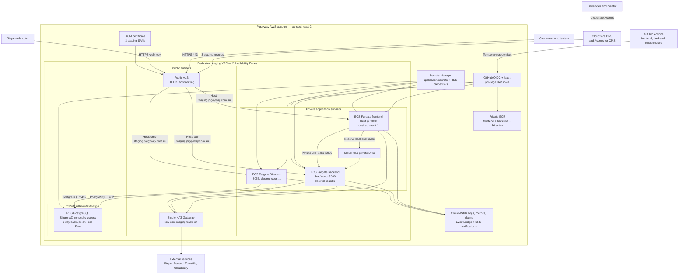

# AWS staging architecture and delivery plan

**Status:** Proposed for approval

**Region:** Australia (Sydney), `ap-southeast-2`

**Cost profile:** Cost-conscious managed staging

**Last reviewed:** 2026-08-07

## 1. Purpose

This document defines the target design submitted for approval for a dedicated
AWS staging environment for the Piggyway frontend and backend. Once approved,
it is the shared technical reference for infrastructure provisioning,
application delivery, operations, and future staging changes.

This is a design document rather than an execution log. The readiness checklist
in section 16 is completed before resource creation begins.

The architecture includes the PostgreSQL and Directus services required by the
applications so that networking, security, delivery order, recovery, and cost
are reviewed as one system.

## 2. Decisions

| Area                  | Decision                                                                                                                                                      | Reason                                                                                                                                                            |
| --------------------- | ------------------------------------------------------------------------------------------------------------------------------------------------------------- | ----------------------------------------------------------------------------------------------------------------------------------------------------------------- |
| AWS Region            | `ap-southeast-2` (Sydney)                                                                                                                                     | Closest AWS Region to the Australian business and users.                                                                                                          |
| AWS account           | Use the developer-owned AWS account, with a dedicated staging VPC, roles, secrets, repositories, and cost tags                                                | Confirmed for staging. Resource-level isolation is proportionate for the two-person project; revisit a dedicated production account before launch.                |
| DNS ownership         | Cloudflare manages the `piggyway.com.au` DNS zone                                                                                                             | Confirmed by the developer and mentor. The developer prepares changes and the mentor approves them.                                                               |
| Frontend domain       | `staging.piggyway.com.au`                                                                                                                                     | Confirmed staging hostname.                                                                                                                                       |
| Backend domain        | `api-staging.piggyway.com.au`                                                                                                                                 | Confirmed staging hostname.                                                                                                                                       |
| Directus domain       | `cms-staging.piggyway.com.au`, protected for the developer and mentor with Cloudflare Access                                                                  | Gives the staging CMS an explicit, restricted administration endpoint without purchasing another load balancer.                                                   |
| Application compute   | Amazon ECS on Fargate, with separate frontend, backend, and Directus services                                                                                 | The services are container workloads with independent deployment and scaling needs; no project member must maintain host operating systems.                       |
| Database              | Amazon RDS for PostgreSQL, Single-AZ, initially `db.t4g.micro` with 20 GiB gp3; one-day automated backup retention while the account remains on AWS Free Plan | The Free Plan rejected the requested seven-day retention. Restore seven days after a paid-plan upgrade; deletion protection and final snapshots remain mandatory. |
| Ingress               | One internet-facing Application Load Balancer with host-based routing                                                                                         | Serves all three staging domains without paying for separate load balancers.                                                                                      |
| Service networking    | Fargate tasks and RDS in private subnets with no public IPs                                                                                                   | Prevents direct access to containers and PostgreSQL. Public traffic enters only through the ALB.                                                                  |
| Outbound access       | One managed NAT Gateway for the staging VPC                                                                                                                   | The applications require external HTTPS services. A single NAT is the cost-conscious managed option and is intentionally not multi-AZ.                            |
| Service discovery     | AWS Cloud Map private namespace for frontend-to-backend traffic                                                                                               | Allows the Next.js BFF to call the backend privately instead of hairpinning through the public ALB.                                                               |
| Container registry    | One private ECR repository per Fargate service                                                                                                                | Keeps image lifecycle and deploy permissions independent.                                                                                                         |
| Directus file storage | Persist staging uploads in the approved Cloudinary staging configuration; do not use Fargate local storage                                                    | The application already uses Cloudinary, while Fargate ephemeral storage cannot safely retain CMS uploads.                                                        |
| IaC                   | Terraform under `infrastructure/` in the existing frontend repository                                                                                         | Follows the mentor's decision to keep deployment code in the existing repositories; a dedicated infrastructure branch and PR still isolate review.                |
| Terraform state       | Versioned, encrypted S3 backend with native S3 lockfile                                                                                                       | Provides remote state recovery and locking without the deprecated DynamoDB locking pattern.                                                                       |
| Delivery identity     | GitHub Actions OIDC to narrowly scoped AWS IAM roles                                                                                                          | Avoids long-lived AWS access keys in GitHub.                                                                                                                      |
| Minimum capacity      | One task for each Fargate service and one Single-AZ RDS instance                                                                                              | Appropriate for staging. Rolling application deployments may temporarily run two tasks per service.                                                               |
| Rollback              | ECS rolling deployment circuit breaker with rollback, alarm-based rollback, and a workflow smoke-test fallback                                                | Returns an application service to the last completed task definition when a release cannot become healthy.                                                        |
| Delivery sequence     | Provision shared AWS foundations, then RDS and Directus, then backend and frontend application releases                                                       | The backend needs a working schema and staging data before its end-to-end smoke tests can pass.                                                                   |

## 3. Application facts that drive the design

### Frontend

- Next.js 16 standalone server on Node.js 22.
- Container listens on port `3000` and runs as a non-root user.
- Server-side `/api/*` routes act as a BFF and use `API_BASE_URL` to call the
  backend.
- Email-code login currently uses the browser-visible
  `NEXT_PUBLIC_API_BASE_URL`, so the staging backend API requires public HTTPS
  access in addition to private BFF access.
- The frontend does not currently have a lightweight health route. A
  dependency-free `GET /api/health` returning HTTP 200 must be added before the
  first deployment.

### Backend

- Bun 1.3, Hono, Drizzle ORM, PostgreSQL, and OpenAPI.
- Container listens on port `3000`, runs as a non-root user, and already
  exposes `GET /health`.
- Directly connects to PostgreSQL using a pool of up to 10 connections per
  task. Directus owns the database schema; Drizzle is a typed mirror.
- Requires outbound HTTPS for Stripe, Resend, Cloudflare Turnstile, and
  Cloudinary.
- Stripe calls the public `POST /api/v1/checkout/webhook` endpoint.
- Request rate limiting and a short-lived webhook cache are process-local.
  With the initial single backend task this is consistent; scaling above one
  task requires accepting per-task limits or moving shared state to a managed
  store in a separate change.

### Directus and PostgreSQL dependency

- Directus is a separate CMS application; it is not the PostgreSQL database.
- The first staging release pins Directus `11.14.1`, matching the repository's
  existing schema snapshot. Upgrade work is deferred until a fresh snapshot is
  exported and rehearsed against the target version.
- The backend and Directus connect to the same dedicated staging PostgreSQL
  database, but use separate credentials with only the permissions each
  service requires.
- Directus runs as its own Fargate service so that it can be deployed,
  restarted, sized, and rolled back without affecting the frontend or backend.
- Directus uploads must use the approved Cloudinary staging configuration.
  Files written only to Fargate ephemeral storage would be lost when a task is
  replaced.
- RDS and Directus provisioning and database initialization are prerequisites
  for a fully functioning backend deployment.

## 4. Architecture



## 5. Request and trust boundaries

### Public ingress

1. Cloudflare-proxied DNS records for all three staging domains resolve to the
   shared ALB. Cloudflare uses Full (strict) TLS to the ALB origin.
2. Port 80 only redirects to HTTPS 443.
3. The HTTPS listener uses an ACM certificate containing all three exact domain
   names.
4. Listener host rules route the frontend, API, and CMS hostnames to their
   corresponding target groups.
5. Requests with any other host receive a fixed HTTP 404 response.
6. Stripe reaches `/api/v1/checkout/webhook` through the API hostname.
7. Cloudflare Access restricts the CMS hostname to the developer and mentor.
   Direct service-to-service traffic does not use the public CMS hostname.
8. ALB ingress is restricted to Cloudflare's published proxy IP ranges so that
   the CMS Access policy cannot be bypassed by addressing the ALB directly.

AWS Shield Standard protection is included by default. AWS WAF is not included
in the first staging iteration because of the budget; add it if the public API
experiences abuse that application rate limits cannot control.

### Private service access

- No ECS service or RDS instance receives a public IP.
- The ALB security group is the only general ingress source for the three
  Fargate services.
- The frontend security group is additionally allowed to reach backend port
  3000 through the backend security group.
- Only the backend and Directus security groups may reach RDS on TCP 5432.
- RDS uses a DB subnet group covering two private database subnets and
  `publicly_accessible = false`. Single-AZ describes database availability, not
  the subnet-group requirement.
- The frontend runtime `API_BASE_URL` uses the Cloud Map backend name, for
  example `http://backend.piggyway-staging.local:3000`.
- The browser-visible `NEXT_PUBLIC_API_BASE_URL` remains
  `https://api-staging.piggyway.com.au` for the current email-login flow.
- Private subnets use one NAT Gateway for outbound internet access. This is a
  deliberate staging availability trade-off: loss of the NAT Availability
  Zone interrupts outbound calls until recovery, but avoids the cost of a
  second NAT Gateway.
- PostgreSQL traffic remains inside the VPC and does not traverse the NAT
  Gateway or public internet.

### Security groups

| Security group                 | Inbound                                                                  | Outbound                                                    |
| ------------------------------ | ------------------------------------------------------------------------ | ----------------------------------------------------------- |
| `piggyway-staging-alb-sg`      | TCP 80 and 443 from published Cloudflare proxy ranges; 80 redirects only | Application ports to frontend, backend, and Directus groups |
| `piggyway-staging-frontend-sg` | TCP 3000 from ALB security group only                                    | TCP 3000 to backend group; TCP 443 through NAT; DNS         |
| `piggyway-staging-backend-sg`  | TCP 3000 from ALB and frontend security groups only                      | TCP 443 through NAT; TCP 5432 to RDS group; DNS             |
| `piggyway-staging-directus-sg` | TCP 8055 from ALB security group only                                    | TCP 443 through NAT; TCP 5432 to RDS group; DNS             |
| `piggyway-staging-rds-sg`      | TCP 5432 from backend and Directus groups only                           | No application-initiated internet egress required           |

## 6. Resource inventory

Names are proposed and may receive an AWS account suffix where global
uniqueness is required. The inventory describes the complete target staging
environment, regardless of the order in which resources are provisioned.

| Service         | Resource                                       |       Count | Proposed name / configuration                                                                |
| --------------- | ---------------------------------------------- | ----------: | -------------------------------------------------------------------------------------------- |
| VPC             | VPC                                            |           1 | `piggyway-staging-vpc`, an approved non-overlapping RFC1918 IPv4 CIDR                        |
| VPC             | Public subnets                                 |           2 | One per Availability Zone for ALB and NAT                                                    |
| VPC             | Private application subnets                    |           2 | One per Availability Zone for Fargate tasks                                                  |
| VPC             | Private database subnets                       |           2 | One per Availability Zone for the RDS DB subnet group; no default internet route             |
| VPC             | Internet Gateway                               |           1 | Attached to staging VPC                                                                      |
| VPC             | NAT Gateway and Elastic IP                     |      1 each | Public subnet in the primary AZ                                                              |
| ELB             | Application Load Balancer                      |           1 | `piggyway-staging-alb`, internet-facing, two public subnets                                  |
| ELB             | Target groups                                  |           3 | Frontend/backend on port 3000 and Directus on port 8055; IP targets                          |
| ACM             | Public certificate                             |           1 | SANs for frontend, API, and CMS staging domains; Cloudflare DNS validation                   |
| ECS             | Cluster                                        |           1 | `piggyway-staging`                                                                           |
| ECS             | Services                                       |           3 | `piggyway-staging-frontend`, `piggyway-staging-backend`, and `piggyway-staging-directus`     |
| ECS             | Task definitions                               |  3 families | Immutable revisions for frontend, backend, and Directus                                      |
| Cloud Map       | Private namespace and backend service          |      1 each | `piggyway-staging.local`, service `backend`                                                  |
| ECR             | Private repositories                           |           3 | One immutable, lifecycle-managed repository per service                                      |
| Secrets Manager | Application JSON secrets                       |           3 | `piggyway/staging/frontend`, `piggyway/staging/backend`, and `piggyway/staging/directus`     |
| Secrets Manager | RDS-managed master credential                  |           1 | Generated and rotated by RDS; never stored in Terraform input or output                      |
| RDS             | PostgreSQL DB instance                         |           1 | Single-AZ `db.t4g.micro`, 20 GiB gp3, private, encrypted; one-day Free Plan backup retention |
| RDS             | DB subnet and parameter groups                 |      1 each | Two private database subnets and a pinned supported PostgreSQL major version                 |
| CloudWatch      | Log groups                                     |           3 | One per Fargate service with 14-day retention                                                |
| CloudWatch      | Dashboard                                      |           1 | ALB, target health, ECS CPU/memory, task count, 4xx/5xx, response time                       |
| CloudWatch      | Alarms                                         | Initial set | Application health/deployment alarms plus RDS CPU, storage, connections, and freeable memory |
| EventBridge/SNS | Deployment failure rule and notification topic |      1 each | Notify the project developer and mentor; no secret values in messages                        |
| IAM             | ECS execution roles                            |           3 | One per service, scoped to its ECR repository, log group, and secret                         |
| IAM             | ECS task roles                                 |           3 | No AWS API permissions initially; add explicit actions only when application code needs them |
| IAM             | GitHub deployment role                         |           1 | Shared by the three repositories and scoped to the three staging services                    |
| IAM             | Terraform plan/apply roles                     |           2 | Read-only plan role and approval-gated apply role                                            |
| S3              | Terraform state bucket                         |           1 | Versioned, blocked public access, SSE-S3, native lockfile                                    |
| Budgets         | Monthly cost budget                            |           1 | Alert at 80% and 100% of the approved staging budget                                         |

### Architecture boundaries

- This design covers the AWS staging environment and its delivery path; it does
  not create resources by itself.
- Production infrastructure, production data migration, and production
  availability requirements require a separate architecture review.
- Self-hosted monitoring or centralized logging may later augment the design.
  CloudWatch remains the minimum AWS operational baseline and retains the
  signals used by deployment rollback.

## 7. Task sizing and availability

| Service  |       CPU |  Memory | Desired/minimum tasks | Deployment maximum | Health path                                         |
| -------- | --------: | ------: | --------------------: | -----------------: | --------------------------------------------------- |
| Frontend |  0.5 vCPU |   1 GiB |                     1 |      2 temporarily | `GET /api/health` — must be added before deployment |
| Backend  | 0.25 vCPU | 0.5 GiB |                     1 |      2 temporarily | `GET /health` — already implemented                 |
| Directus | 0.25 vCPU |   1 GiB |                     1 |      2 temporarily | `GET /server/health`                                |

All Fargate tasks use Linux/x86_64 initially and the Fargate-provided 20 GiB
ephemeral storage. CPU and memory alarms are used to validate these starting
sizes. Move to ARM64 only after all three images and their dependencies pass
staging tests on ARM; it is a later cost optimization, not part of the initial
rollout.

For rolling updates use desired count 1, `minimumHealthyPercent = 100`, and
`maximumPercent = 200`. ECS starts the candidate task and waits for health
before stopping the previous task, so deployments briefly incur two-task cost.
This is not full high availability: an infrastructure or AZ failure can cause
a staging outage. That is accepted for the low-cost environment.

Autoscaling is not enabled initially. A human-reviewed change may raise desired
count or task size after CloudWatch shows sustained pressure.

RDS starts as a Single-AZ `db.t4g.micro` PostgreSQL instance with 20 GiB of gp3
storage, storage autoscaling bounded by an approved maximum, encryption at
rest, deletion protection, and a final snapshot required before an intentional
destroy. The AWS Free Plan currently limits automated backup retention to one
day; restore the intended seven-day retention after an account upgrade.
CloudWatch freeable-memory, connection, CPU, and free-storage alarms determine
whether it must be resized to `db.t4g.small`; staging does not start with
Multi-AZ.

## 8. Health checks and smoke tests

### ALB checks

- Protocol: HTTP from ALB to the configured target port: 3000 for frontend and
  backend, or 8055 for Directus.
- Interval: 30 seconds.
- Timeout: 5 seconds.
- Healthy threshold: 2.
- Unhealthy threshold: 3.
- Success code: 200.
- Frontend path: `/api/health`, containing no backend or database dependency.
- Backend path: `/health`, containing no database mutation.
- Directus path: `/server/health`, containing no database mutation.

### Post-deployment smoke tests

After ECS reaches a stable state, the deployment workflow performs:

1. `GET https://staging.piggyway.com.au/api/health`.
2. `GET https://api-staging.piggyway.com.au/health`.
3. An authenticated health check for
   `https://cms-staging.piggyway.com.au/server/health` from the Directus
   deployment workflow. Its Cloudflare Access credential must be retrieved at
   runtime and never committed or printed.
4. One read-only product/category request through the frontend BFF to verify
   frontend-to-backend and backend-to-database connectivity.
5. A response-header check for HTTPS and the expected staging host.

Authentication, payment, email, and webhook tests remain manual release checks
because they touch third-party test accounts.

## 9. Secrets and configuration

Use one JSON secret per Fargate application to reduce Secrets Manager cost
while retaining separate frontend/backend/Directus access control. RDS manages
its generated master credential in a separate Secrets Manager secret. ECS task
definitions inject individual JSON keys. Secret values must never be Terraform
variables, image build arguments, Terraform outputs, GitHub secrets, workflow
logs, or source files.

Terraform creates only the empty secret containers and IAM policies. After
provisioning, the project developer populates secret versions through an
audited, temporary `aws login` session after the mentor confirms the source account and
rotation status. A secret update is followed by an explicit ECS
force-new-deployment so new tasks receive the new values.

### Frontend runtime secret keys

- `STRIPE_SECRET_KEY`
- `NEXTAUTH_SECRET`
- `GOOGLE_CLIENT_SECRET`
- `PREVIEW_SECRET`

### Backend runtime secret keys

- `DATABASE_URL`
- `JWT_SECRET`
- `STRIPE_SECRET_KEY`
- `STRIPE_WEBHOOK_SECRET`
- `RESEND_API_KEY`
- `TURNSTILE_SECRET_KEY`
- `CLOUDINARY_API_SECRET`
- `PREVIEW_SECRET`

### Directus runtime secret keys

- Directus `SECRET`
- Dedicated staging database username/password
- Initial administrator bootstrap credential, removed or rotated after setup
- Cloudinary staging API credentials

The backend and Directus must not use the RDS master user during normal
operation. The database/bootstrap procedure creates dedicated users and stores
their credentials only in the matching application secret.

### Non-secret runtime/build configuration

This includes ports, hostnames, `TOKEN_ISS`, `TOKEN_AUD`, `FRONTEND_URL`,
Cloudinary public identifiers, Google client ID, public Stripe/Turnstile keys,
`NEXTAUTH_URL`, `NEXT_PUBLIC_APP_URL`, `NEXT_PUBLIC_SITE_URL`, and both backend
URLs described in section 5.

`NEXT_PUBLIC_*` values are intentionally embedded in the frontend image at
build time and are not secrets. Private values must not be passed as Docker
build arguments.

Before staging deployment, rotate any populated credential-like value that has
ever appeared in a tracked example environment file, then replace it with an
empty placeholder. Record completion in the project change history without
recording the value.

## 10. Least-privilege IAM

### ECS execution roles

Create separate execution roles for the frontend, backend, and Directus. Each
role may:

- pull only from its own ECR repository;
- write only to its own CloudWatch log group;
- read only its own Secrets Manager secret and the AWS-managed encryption key;
- perform the standard ECS task execution actions required by Fargate.

### ECS task roles

Application code currently uses external HTTP services and PostgreSQL rather
than AWS APIs. Start all task roles with no application permissions. Do not
reuse an execution role as a task role. Add a narrowly scoped AWS permission
only if a future approved Directus storage design replaces Cloudinary with an
AWS service.

### GitHub application deployment role

Use one role trusted only by the frontend, backend, and CMS repositories when
they deploy through the GitHub `staging` environment. The role may:

- authenticate and push only to the three staging ECR repositories;
- register task-definition revisions only for the three staging families;
- pass only the six staging execution and task roles;
- update and describe only the three staging ECS services;
- read deployment state and relevant logs/alarms needed to verify rollout.

It may not read runtime secret values or change networking, RDS, load balancers,
IAM, or any non-staging service.

### Terraform roles

- `TerraformPlanRole`: read AWS configuration and state; write only the S3
  lockfile needed for a plan.
- `TerraformApplyRole`: manage only resources tagged
  `Project=piggyway, Environment=staging`, plus the explicitly named global IAM,
  ACM, ECR, and state resources.
- The apply role is available only to the protected staging infrastructure
  environment in the frontend repository after mentor approval.
- For this AWS Free plan account, human access uses an MFA-protected IAM
  administrator and temporary browser-based `aws login` credentials. IAM
  Identity Center is intentionally not enabled because joining AWS
  Organizations would upgrade the account and forfeit the remaining credits.
  Root remains a break-glass identity and no long-lived access keys are used.

## 11. Infrastructure as code

### Tool and location

Use Terraform `>= 1.10` with a pinned AWS provider. Keep the configuration in
the existing frontend repository, reviewed through a dedicated infrastructure
branch and PR, with this layout:

```text
piggy-frontend/
└── infrastructure/
    ├── bootstrap/
    │   └── state/             # one-time state bucket and GitHub OIDC bootstrap
    ├── modules/
    │   ├── network/
    │   ├── load-balancer/
    │   ├── ecs-service/
    │   ├── database/
    │   ├── ecr/
    │   ├── observability/
    │   └── github-oidc/
    └── environments/
        └── staging/
            ├── backend.tf
            ├── main.tf
            ├── providers.tf
            ├── variables.tf
            └── outputs.tf
```

Use one staging root state initially. Splitting state before the environment is
large enough to need independent ownership adds complexity without useful
isolation.

### State storage

- S3 bucket:
  `piggyway-terraform-state-<aws-account-id>-ap-southeast-2`.
- State key: `piggyway/staging/core/terraform.tfstate`.
- Enable bucket versioning, public-access blocking, TLS-only bucket policy, and
  server-side encryption with S3-managed keys to avoid a paid customer-managed
  KMS key for this low-cost environment.
- Set `use_lockfile = true` in the S3 backend.
- Do not use DynamoDB locking; HashiCorp marks that S3 backend mechanism as
  deprecated.
- Permit state access only to the Terraform plan/apply roles. The mentor is the
  accountable break-glass approver and the developer receives only the access
  needed for normal plan/apply work. Terraform state is sensitive even when
  the configuration avoids secret values.

The bootstrap configuration is applied once by the project developer using an
approved AWS role after mentor review, then brought under the normal Terraform
review process.

### Review and apply flow

1. Pull requests run `terraform fmt -check`, `terraform validate`, security
   scanning, and `terraform plan` with the plan role.
2. The plan is attached to the PR without secrets and reviewed by the mentor.
   The developer who authored the change cannot self-approve it.
3. Merge to protected `main` does not automatically grant production access;
   it starts a staging apply job in a GitHub environment requiring mentor
   approval.
4. Apply runs only the previously reviewed commit, then stores the plan/apply
   summary as an artifact.
5. Drift detection runs weekly as a read-only plan and opens an alert; it does
   not auto-apply.
6. Console changes are emergency-only and must be reconciled into Terraform on
   the next working day.

## 12. Application delivery plan

The frontend and backend staging workflows run a quality gate and then deploy
automatically after a merge to `staging`. The CMS workflow remains manual-only.
Manage the pinned Directus image and its deployment workflow from the existing
`piggy-cms` repository.

### Database and Directus initialization

The new RDS instance starts empty. Initialize it through a controlled,
auditable process before the first backend release:

1. Generate the RDS master credential through RDS and create distinct Directus
   and backend database users. Normal application tasks never use the master
   user.
2. Run a one-off Directus bootstrap task against RDS to create the Directus
   system tables and initial administrator.
3. Keep the reviewed Directus `11.14.1` snapshot in the existing `piggy-cms`
   repository, alongside the Directus image that owns it. The legacy snapshot
   has been rehearsed against a disposable empty PostgreSQL 16 database and its
   duplicate relation entries removed. Apply it from an auditable one-off task
   rather than a developer laptop.
4. Load a small, versioned staging seed dataset for required products,
   categories, roles, and configuration. Schema snapshots do not contain
   content records.
5. Use synthetic or explicitly sanitized seed data. Do not copy production
   customer, order, authentication, or payment data into staging.
6. Treat the legacy `directus-sync` push as an empty-database bootstrap only;
   it is not an idempotent migration runner and must not run on every service
   startup. Refuse to reapply it when the application schema already exists.
7. Verify Directus login, a read-only backend query, and the frontend product
   flow, then rotate or remove the initial administrator bootstrap credential.

Schema changes are reviewed with the backend code that depends on them. Prefer
backward-compatible additions, take a manual snapshot before destructive
changes, apply schema changes before code that requires them, and validate the
restore procedure periodically. The Backend staging release runs only new,
versioned Backend migrations from the current AWS database baseline; it never
replays the legacy Drizzle journal or runs an implicit schema push.

### Trigger and review

- Pull requests targeting `staging` run the quality gate but do not push or
  deploy.
- A push/merge to protected `staging` may deploy after all required checks pass.
- Use the GitHub `staging` environment for OIDC scoping, deployment history,
  while routine application releases do not require manual approval.
- A manual workflow dispatch may redeploy an existing immutable image digest
  for rollback or recovery.

### Build and release steps

1. Check out the exact commit and run the repository quality gate.
2. Reuse the ECR image if the full commit SHA already exists; otherwise build
   the existing Dockerfile once.
3. Tag the image with the full Git commit SHA; do not deploy `latest`.
4. Authenticate to AWS using GitHub OIDC.
5. Push only to the repository's ECR repository, which uses immutable tags and
   lifecycle rules retaining the most recent 10 release images.
6. For a Backend push, run the release image as the approved one-off staging
   migration task. Stop before application deployment if it fails.
7. Register a new task-definition revision referencing the immutable image
   digest.
8. Update only the matching ECS service and wait up to 10 minutes for stable
   state.
9. Record commit SHA, image digest, migration result, task-definition revision,
   initiator, and result in the GitHub deployment summary.

Frontend releases never change the database. Backend releases never run
`db:push` or replay the legacy migration journal. Directus-owned catalogue
schema changes remain a separate reviewed CMS release.

## 13. Rollback policy

Enable the ECS rolling deployment circuit breaker with automatic rollback for
all three services. Also associate deployment alarms where supported.

A deployment is failed and rolled back when any of these occurs:

- the new tasks fail to reach ECS stable state within 10 minutes;
- the ECS deployment circuit breaker reaches its task-start or health-check
  failure threshold;
- the target group has zero healthy candidate targets for two consecutive
  one-minute periods;
- target HTTP 5xx responses reach at least five in a five-minute deployment
  window;
- any required post-deployment smoke test fails.

The automatic rollback target is the most recent ECS deployment in completed
state. If ECS has declared the service stable but a smoke test then fails, the
workflow registers/activates the previously recorded task-definition revision
and waits for it to stabilize. Never rebuild an old commit to roll back; deploy
the retained image digest.

After rollback:

1. Notify the deployment-failure SNS destination through EventBridge.
2. Preserve failed task logs and the image digest.
3. Do not retry automatically in a loop.
4. Require a new commit or an explicitly approved redeploy after the cause is
   understood.

Application rollback is not coupled to database rollback. Schema changes need
a reviewed, backward-compatible migration and restore procedure; an ECS task
rollback must never automatically restore an RDS snapshot.

## 14. Logging, monitoring, and retention

- Send each Fargate service's stdout/stderr to a separate CloudWatch log group
  through the `awslogs` driver.
- Use JSON or structured single-line logs where possible and propagate the
  existing `X-Request-Id` across ALB, frontend BFF, and backend.
- Retain application logs for 14 days initially. Do not log tokens, cookies,
  authorization headers, secret values, payment data, or full customer
  addresses.
- Dashboard metrics include desired/running task count, Fargate CPU/memory,
  ALB target response time, healthy host count, 4xx, 5xx, NAT bytes, and RDS
  CPU, freeable memory, connections, free storage, and backup failures.
- Alerts notify only actionable conditions: service unavailable, failed
  deployment, sustained resource exhaustion, and budget thresholds.
- Future visualization and centralized logging may augment this baseline but
  must not remove the CloudWatch signals used for ECS rollback.

## 15. Initial monthly cost estimate

This is a planning estimate in USD for Sydney, dated 2026-08-07. It assumes 730
hours/month, low staging traffic, one always-running task per Fargate service,
one Single-AZ RDS instance, 5–10 GB of monthly outbound/NAT processing, 14-day
logs, three application JSON secrets, and one RDS-managed credential. AWS
prices and usage vary; refresh and review an AWS Pricing Calculator estimate
immediately before resource creation.

| Item                                                        | Assumption                                         |   Estimated USD/month |
| ----------------------------------------------------------- | -------------------------------------------------- | --------------------: |
| Fargate frontend                                            | 0.5 vCPU, 1 GiB, 24×7                              |                 20–25 |
| Fargate backend                                             | 0.25 vCPU, 0.5 GiB, 24×7                           |                 10–13 |
| Fargate Directus                                            | 0.25 vCPU, 1 GiB, 24×7                             |                 12–18 |
| RDS PostgreSQL                                              | Single-AZ `db.t4g.micro`, 20 GiB gp3, backups      |                 25–45 |
| Application Load Balancer                                   | One ALB plus low LCU usage                         |                 20–27 |
| NAT Gateway                                                 | One gateway plus low data processing               |                 43–50 |
| Public IPv4 addresses                                       | ALB addresses and one NAT Elastic IP               |                  8–12 |
| CloudWatch/EventBridge/SNS                                  | Three services, RDS metrics, dashboard, alarms     |                  4–10 |
| Secrets Manager                                             | Three JSON secrets, RDS credential, low API volume |                   1–3 |
| ECR                                                         | Three repositories, lifecycle-capped image storage |                   1–4 |
| Cloud Map, S3 state, DNS validation, miscellaneous transfer | Low usage                                          |                   2–6 |
| **Expected total**                                          | Excludes tax and non-AWS external service charges  | **145–215 USD/month** |

The current AWS Budget is **100 USD/month**, with actual-spend and forecast
alerts. This is an alerting threshold, not evidence that the full 24×7 design
fits within the remaining Free plan credits. The mentor must approve whether
the complete environment runs continuously or is torn down when not needed.

### Cost controls

- Keep desired count at one and do not enable autoscaling by default.
- Retain only 10 ECR release images and expire untagged images after seven days.
- Retain logs for 14 days.
- Use one NAT Gateway; accept the documented staging availability trade-off.
- Use SSE-S3 and AWS-managed service keys rather than paid customer-managed KMS
  keys unless compliance requirements change.
- After initial stabilization, optionally schedule the three ECS services to
  desired count zero outside agreed testing hours. This reduces Fargate cost
  but does not remove the fixed ALB/NAT/RDS cost. RDS may be stopped manually
  for short periods, but AWS automatically restarts a stopped DB instance after
  its maximum supported stop duration, so scheduling assumptions must not rely
  on indefinite RDS shutdown.
- Review Cost Explorer monthly by the required tags.

Do not move Fargate tasks to public subnets merely to save NAT cost without a
new security review. A NAT instance can reduce fixed cost but adds patching,
failover, throughput, and operational ownership; it is not the approved
baseline.

## 16. Ownership and readiness

### Two-person ownership model

The project currently has two active contributors. The project developer is
the implementer and day-to-day maintainer; the mentor is the accountable
technical and cost approver. This avoids inventing separate platform, DevOps,
frontend, backend, and product teams that do not exist.

| Area                         | Implementer       | Accountable approver | Responsibility                                                                                                        |
| ---------------------------- | ----------------- | -------------------- | --------------------------------------------------------------------------------------------------------------------- |
| Infrastructure and Terraform | Project developer | Mentor               | Developer authors plans and applies approved changes; mentor reviews architecture, plan, IAM, networking, and apply   |
| Frontend application         | Project developer | Mentor               | Developer owns image, health route, configuration, deploy, and smoke test; mentor approves the release policy         |
| Backend application          | Project developer | Mentor               | Developer owns image, health, database compatibility, webhook, deploy, and smoke test                                 |
| Secrets                      | Project developer | Mentor               | Developer populates/rotates AWS secrets; mentor confirms provider ownership and that exposed values were rotated      |
| DNS and domain               | Project developer | Mentor               | Cloudflare is authoritative; developer prepares the three records and CMS Access policy, and mentor reviews them      |
| Database/Directus            | Project developer | Mentor               | Developer implements RDS/Directus, initialization, backups, credentials, and connectivity; mentor reviews the changes |
| Cost                         | Project developer | Mentor               | Developer monitors credits and the 100 USD budget; mentor approves runtime duration and any revised threshold         |

The frontend repository lists both GitHub accounts in `CODEOWNERS` for the
`infrastructure/` path. The protected target branch requires one non-author
approving review, which in the normal developer-authored flow is the mentor.
The protected GitHub staging infrastructure environment names the mentor as
the required Terraform apply reviewer.

### Readiness checklist before provisioning

- [ ] Record the developer-owned AWS account ID, configure MFA/approved human
      access, and confirm the mentor's infrastructure approval responsibility.
- [ ] Confirm both project members have the required Cloudflare access to add
      the three staging DNS records, ACM validation records, and the restricted
      CMS Access policy.
- [ ] Confirm the new RDS database contains staging-only data and that no
      production customer/order data is copied by assumption.
- [ ] Review the initial RDS size, temporary one-day Free Plan backup
      retention, deletion/final snapshot behaviour, separate application
      users, and maximum connections for rolling backend and Directus
      deployments.
- [ ] Confirm the Directus staging Cloudinary configuration and verify that no
      required upload is stored only on Fargate ephemeral storage.
- [ ] Review the version-controlled Directus schema snapshot, sanitized seed
      data, one-off bootstrap process, and initial administrator rotation.
- [ ] Mentor confirms whether staging runs continuously or is torn down when
      idle, reviews the 100 USD/month alert threshold, and confirms recipients.
- [ ] Rotate credential-like values previously tracked in example environment
      files and confirm only placeholders remain.
- [ ] Create/configure third-party staging or test endpoints, including Stripe
      test-mode webhook registration for
      `https://api-staging.piggyway.com.au/api/v1/checkout/webhook`.
- [ ] Add and test the frontend `GET /api/health` route.
- [ ] Mentor reviews and approves this architecture; the developer records that
      approval in the project change history.

## 17. References

- [AWS Fargate pricing](https://aws.amazon.com/fargate/pricing/)
- [Elastic Load Balancing pricing](https://aws.amazon.com/elasticloadbalancing/pricing/)
- [NAT Gateway pricing](https://docs.aws.amazon.com/vpc/latest/userguide/nat-gateway-pricing.html)
- [AWS ECS outbound networking](https://docs.aws.amazon.com/AmazonECS/latest/developerguide/networking-outbound.html)
- [AWS ECS network security best practices](https://docs.aws.amazon.com/AmazonECS/latest/developerguide/security-network.html)
- [AWS ECS deployment circuit breaker](https://docs.aws.amazon.com/AmazonECS/latest/developerguide/deployment-circuit-breaker.html)
- [AWS Secrets Manager pricing](https://aws.amazon.com/secrets-manager/pricing/)
- [Amazon ECR pricing](https://aws.amazon.com/ecr/pricing/)
- [Amazon RDS for PostgreSQL](https://docs.aws.amazon.com/AmazonRDS/latest/UserGuide/CHAP_PostgreSQL.html)
- [Amazon RDS for PostgreSQL pricing](https://aws.amazon.com/rds/postgresql/pricing/)
- [Cloudflare Access applications](https://developers.cloudflare.com/cloudflare-one/access-controls/applications/)
- [GitHub Actions OIDC with AWS](https://docs.github.com/en/actions/how-tos/secure-your-work/security-harden-deployments/oidc-in-aws)
- [Terraform S3 backend and native lockfile](https://developer.hashicorp.com/terraform/language/backend/s3)
